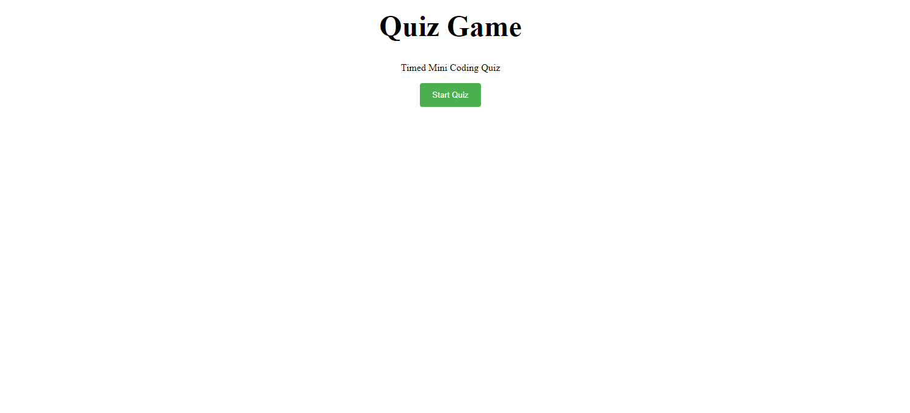

# Timed Coding Quiz

## Description
A Timed mini coding quiz with 3 questions which includes a timer that decreased each time a question is answerd incorrectly. As well as a text input for your intials at the end to save your score.

## Demo

The following image demonstrates the application functionality:

## Links

https://github.com/Badermah/quiz

https://badermah.github.io/quiz/